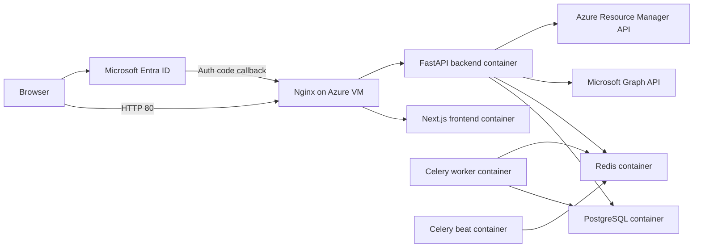

# Architecture

## Runtime Boundaries

- Browser never receives ARM refresh tokens or backend ARM access tokens.
- Backend validates Microsoft claims and issues an HTTP-only app session cookie.
- Background sync uses encrypted refresh tokens stored in PostgreSQL.
- Inventory data is keyed by internal `tenant_id`.
- Nginx exposes one public endpoint and routes `/auth/*`, `/api/*`, and `/healthz` to FastAPI.

