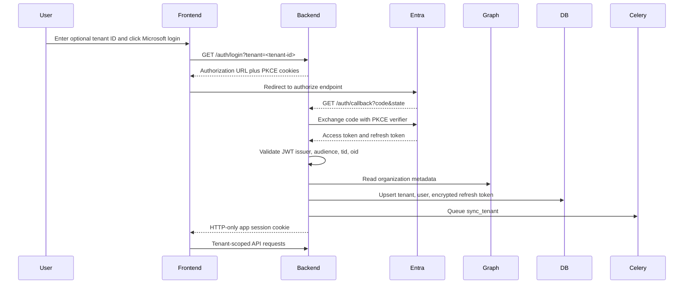

# Authentication Flow

The backend never trusts frontend-provided tenant claims. It derives `tid`, `oid`, and email from Microsoft-validated token claims.

If `tenant` is omitted, login uses the multi-tenant `/common` authority. If `tenant` is supplied, the authorize and token exchange use that tenant-specific authority, which helps users avoid accidentally selecting a personal Microsoft consumer identity.
