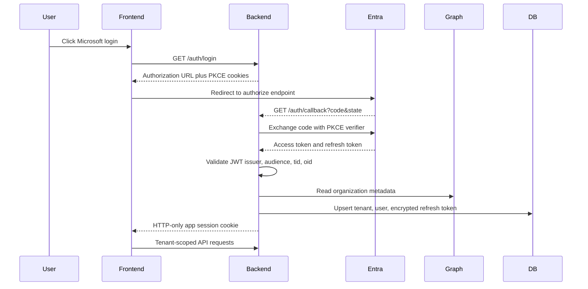

# Authentication Flow

```mermaid
sequenceDiagram
  participant User
  participant Frontend
  participant Backend
  participant Entra
  participant Graph
  participant DB

  User->>Frontend: Click Microsoft login
  Frontend->>Backend: GET /auth/login
  Backend-->>Frontend: Authorization URL plus PKCE cookies
  Frontend->>Entra: Redirect to authorize endpoint
  Entra-->>Backend: GET /auth/callback?code&state
  Backend->>Entra: Exchange code with PKCE verifier
  Entra-->>Backend: Access token and refresh token
  Backend->>Backend: Validate JWT issuer, audience, tid, oid
  Backend->>Graph: Read organization metadata
  Backend->>DB: Upsert tenant, user, encrypted refresh token
  Backend-->>Frontend: HTTP-only app session cookie
  Frontend->>Backend: Tenant-scoped API requests
```

The backend never trusts frontend-provided tenant claims. It derives `tid`, `oid`, and email from Microsoft-validated token claims.

